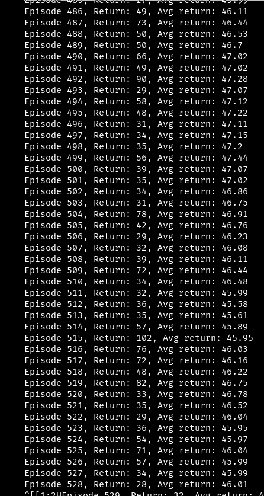

# AlphaZero-CartPole
A simple implementation of DeepMind's AlphaZero on OpenAI's Cartpole gym. Very simple implementation, tree depth is only set to 1


## Usage
You can train the model by executing the following command:
```bash
python alphazero.py
```
Work in progress. Environment is consider solved if an agent is able to achieve and maintain a episodic reward of about 500!!
I suspect I need to run the algorithm for longer or change network.
// ## results
// <p align="center">  </p>


## Dependencies
- PyTorch
- OpenAI gym

# References
- [AlphaZero simple](http://joshvarty.github.io/AlphaZero/)
- [A Simple Alpha(Go) Zero Tutorial](https://web.stanford.edu/~surag/posts/alphazero.html)
- [MuZero](https://github.com/geohot/ai-notebooks/tree/master/muzero)

